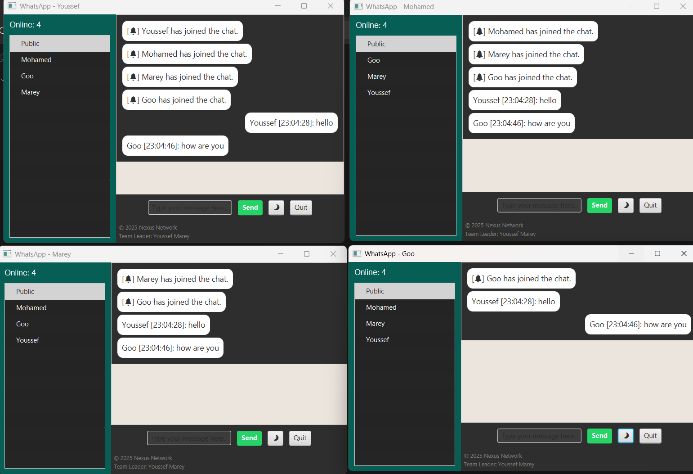
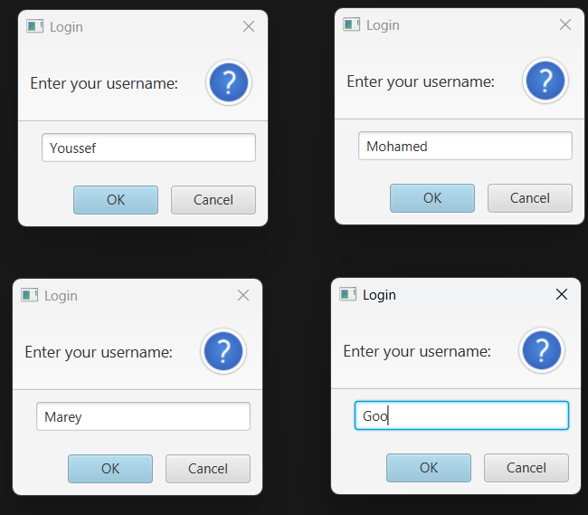
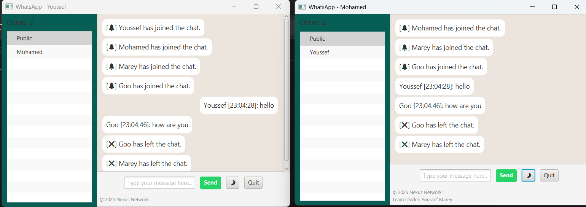

# Chat Application - JavaFX

A real-time multi-client chat application with a modern WhatsApp-like UI built using **JavaFX**.

## 🚀 Features

- Modern WhatsApp-style GUI
- Real-time public and private messaging
- User avatars and online user list
- Dark mode toggle and exit button
- Team attribution display

## 🛠 How to Run

1. Ensure Java 17+ is installed.
2. Place JavaFX SDK 24.0.1 under:  
   `D:/project/javafx-sdk-24.0.1/lib`
3. To run the server:
    ```bash
    run-server.bat
    ```
4. To run the client(s):
    ```bash
    run-client.bat
    ```

## 📂 Project Structure

```
📁 src/                 → Java source files (.java)
⚙️ run-server.bat        → Launches the server
⚙️ run-client.bat        → Launches the client(s)
📄 README.txt            → Plain text manual
```

## 👥 Team

- **Made by:** Nexus Network  
- **Team Leader:** Youssef Marey


## 💬 Interface Screenshots

### 🌓 Dark Mode


### 👥 Four Clients Login


### 🔒 Private & Public Chat


### 👋 Two Clients Left


